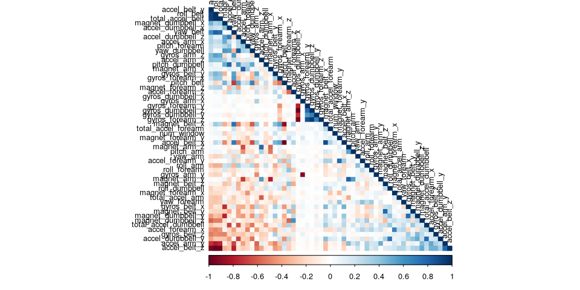
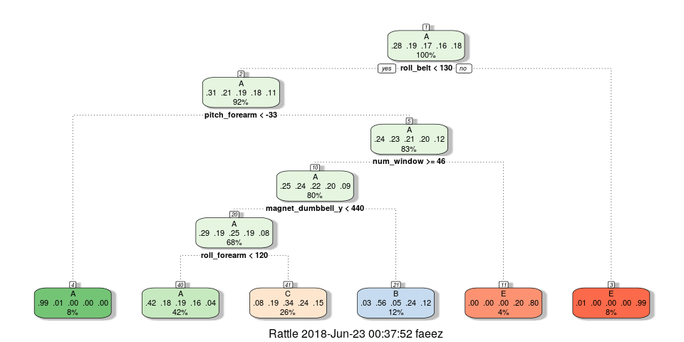

## Executive Summary
Using devices such as Jawbone Up, Nike FuelBand, and Fitbit it is now possible to collect a large amount of data about personal activity relatively inexpensively. These type of devices are part of the quantified self movement – a group of enthusiasts who take measurements about themselves regularly to improve their health, to find patterns in their behavior, or because they are tech geeks. One thing that people regularly do is quantify how much of a particular activity they do, but they rarely quantify how well they do it.

In this project, your goal will be to use data from accelerometers on the belt, forearm, arm, and dumbell of 6 participants. They were asked to perform barbell lifts correctly and incorrectly in 5 different ways. More information is available from the website here: HAR [http://groupware.les.inf.puc-rio.br/har] (see the section on the Weight Lifting Exercise Dataset).

## Libraries
We use the lattice, ggplot2, plyr and libraries

```r
knitr::opts_chunk$set(echo = TRUE, warning=FALSE, message=FALSE, fig.width=10, fig.height=5)
options(width=120)

library(lattice)
library(ggplot2)
library(plyr)
library(randomForest)
```

```
## randomForest 4.6-14
```

```
## Type rfNews() to see new features/changes/bug fixes.
```

```
## 
## Attaching package: 'randomForest'
```

```
## The following object is masked from 'package:ggplot2':
## 
##     margin
```

```r
library(knitr)
library(caret)
library(rpart)
library(rpart.plot)
library(rattle)
```

```
## Rattle: A free graphical interface for data science with R.
## Version 5.1.0 Copyright (c) 2006-2017 Togaware Pty Ltd.
## Type 'rattle()' to shake, rattle, and roll your data.
```

```
## 
## Attaching package: 'rattle'
```

```
## The following object is masked from 'package:randomForest':
## 
##     importance
```

```r
library(corrplot)
```

```
## corrplot 0.84 loaded
```

```r
set.seed(112233)
```

## Download the Data

```r
trainUrl <-"https://d396qusza40orc.cloudfront.net/predmachlearn/pml-training.csv"
testUrl <- "https://d396qusza40orc.cloudfront.net/predmachlearn/pml-testing.csv"
trainFile <- "./data/pml-training.csv"
testFile  <- "./data/pml-testing.csv"
if (!file.exists("./data")) {
  dir.create("./data")
}
if (!file.exists(trainFile)) {
  download.file(trainUrl, destfile=trainFile, method="curl")
}
if (!file.exists(testFile)) {
  download.file(testUrl, destfile=testFile, method="curl")
}
```

## Read the Data
We read the csv files into data frames

```r
train <- read.csv(trainFile)
test <- read.csv(testFile)
dim(train)
```

```
## [1] 19622   160
```

```r
dim(test)
```

```
## [1]  20 160
```

## Clean the Data
The training data will be partioned in order to Training set fro the modelling process and a Test set for validation, the split will be 70%-Training and 30%-Test. The original testing data will be used for the quiz.

```r
#remove variables with variance close to zero
smallVar <- nearZeroVar(train)
cleanedTrain <- train[, -smallVar]
cleanedTest <- test[, -smallVar]
dim(cleanedTrain)
```

```
## [1] 19622   100
```

```r
#remove values that are mostly NA
mostlyNA <- sapply(cleanedTrain, function(x) mean(is.na(x))) > 0.95
cleanedTrain <- cleanedTrain[, mostlyNA == FALSE]
cleanedTest <- cleanedTest[, mostlyNA == FALSE]
dim(cleanedTrain)
```

```
## [1] 19622    59
```

```r
# the first five variables (X, user_name, raw_timestamp_part_1, raw_timestamp_part_2, cvtd_timestamp) aren't needed to make a prediction and are removed
cleanedTrain <- cleanedTrain[, -(1:5)]
cleanedTest <- cleanedTest[, -(1:5)]
dim(cleanedTrain)
```

```
## [1] 19622    54
```

```r
## partition the training dat to train the model
inTrain <- createDataPartition(cleanedTrain$classe, p=0.7, list = FALSE)
TrainSet <- cleanedTrain[inTrain, ]
TestSet <- cleanedTrain[-inTrain, ]
dim(TrainSet)
```

```
## [1] 13737    54
```

```r
dim(TestSet)
```

```
## [1] 5885   54
```

## Correlation Analysis
Before building the model the correlation between variables in analysed

```r
corMatrix <- cor(TrainSet[, -54])
corrplot(corMatrix, order="FPC", method = "color", type = "lower", tl.cex = 0.8, tl.col = rgb(0,0,0))
```

<!-- -->
The dark shades represent pairs of highly correlated varibles. Since the aren't that many we won't perform Principal Components Analysis to further reduced the variables.

## Prediction Model Building
We will test 3 different models: Classification Trees, Random Forest and Gradient Descent.

Cross Validation is used for efficiency and to limit the effect of overfitting. We will use 5 folds

```r
trControl <- trainControl(method="cv", number=5, verboseIter = FALSE)
```

### Classification Trees

```r
# fit model
set.seed(112233)
modDT <- train(classe ~ ., data=TrainSet, method="rpart", trControl=trControl)
fancyRpartPlot(modDT$finalModel)
```

<!-- -->

```r
#prediction
predDT <- predict(modDT, newdata=TestSet)
ConfMatrixDT <- confusionMatrix(predDT, TestSet$classe)
ConfMatrixDT
```

```
## Confusion Matrix and Statistics
## 
##           Reference
## Prediction    A    B    C    D    E
##          A 1516  472  486  415  111
##          B   28  380   32  173   86
##          C  127  287  508  333  240
##          D    0    0    0    0    0
##          E    3    0    0   43  645
## 
## Overall Statistics
##                                           
##                Accuracy : 0.5181          
##                  95% CI : (0.5052, 0.5309)
##     No Information Rate : 0.2845          
##     P-Value [Acc > NIR] : < 2.2e-16       
##                                           
##                   Kappa : 0.371           
##  Mcnemar's Test P-Value : < 2.2e-16       
## 
## Statistics by Class:
## 
##                      Class: A Class: B Class: C Class: D Class: E
## Sensitivity            0.9056  0.33363  0.49513   0.0000   0.5961
## Specificity            0.6476  0.93279  0.79687   1.0000   0.9904
## Pos Pred Value         0.5053  0.54363  0.33980      NaN   0.9334
## Neg Pred Value         0.9452  0.85364  0.88200   0.8362   0.9159
## Prevalence             0.2845  0.19354  0.17434   0.1638   0.1839
## Detection Rate         0.2576  0.06457  0.08632   0.0000   0.1096
## Detection Prevalence   0.5098  0.11878  0.25404   0.0000   0.1174
## Balanced Accuracy      0.7766  0.63321  0.64600   0.5000   0.7933
```

### Random Forest

```r
# fit model
set.seed(112233)
modRF<- train(classe ~ ., data=TrainSet, method="rf", trControl=trControl)
modRF$finalModel
```

```
## 
## Call:
##  randomForest(x = x, y = y, mtry = param$mtry) 
##                Type of random forest: classification
##                      Number of trees: 500
## No. of variables tried at each split: 27
## 
##         OOB estimate of  error rate: 0.25%
## Confusion matrix:
##      A    B    C    D    E  class.error
## A 3904    1    0    0    1 0.0005120328
## B    6 2648    3    1    0 0.0037622272
## C    0    7 2389    0    0 0.0029215359
## D    0    0   10 2241    1 0.0048845471
## E    0    1    0    3 2521 0.0015841584
```

```r
# prediction
predRF <- predict(modRF, newdata=TestSet)
ConfMatrixRF <- confusionMatrix(predRF, TestSet$classe)
ConfMatrixRF
```

```
## Confusion Matrix and Statistics
## 
##           Reference
## Prediction    A    B    C    D    E
##          A 1674    1    0    0    0
##          B    0 1138    2    0    1
##          C    0    0 1024    3    0
##          D    0    0    0  961    1
##          E    0    0    0    0 1080
## 
## Overall Statistics
##                                           
##                Accuracy : 0.9986          
##                  95% CI : (0.9973, 0.9994)
##     No Information Rate : 0.2845          
##     P-Value [Acc > NIR] : < 2.2e-16       
##                                           
##                   Kappa : 0.9983          
##  Mcnemar's Test P-Value : NA              
## 
## Statistics by Class:
## 
##                      Class: A Class: B Class: C Class: D Class: E
## Sensitivity            1.0000   0.9991   0.9981   0.9969   0.9982
## Specificity            0.9998   0.9994   0.9994   0.9998   1.0000
## Pos Pred Value         0.9994   0.9974   0.9971   0.9990   1.0000
## Neg Pred Value         1.0000   0.9998   0.9996   0.9994   0.9996
## Prevalence             0.2845   0.1935   0.1743   0.1638   0.1839
## Detection Rate         0.2845   0.1934   0.1740   0.1633   0.1835
## Detection Prevalence   0.2846   0.1939   0.1745   0.1635   0.1835
## Balanced Accuracy      0.9999   0.9992   0.9987   0.9983   0.9991
```

### Generalised Boosted Model

```r
# fit model
set.seed(112233)
modGBM <- train(classe ~ ., data=TrainSet, method="gbm", trControl=trControl)
```

```
## Iter   TrainDeviance   ValidDeviance   StepSize   Improve
##      1        1.6094            -nan     0.1000    0.1314
##      2        1.5217            -nan     0.1000    0.0871
##      3        1.4648            -nan     0.1000    0.0670
##      4        1.4207            -nan     0.1000    0.0517
##      5        1.3858            -nan     0.1000    0.0434
##      6        1.3572            -nan     0.1000    0.0470
##      7        1.3280            -nan     0.1000    0.0413
##      8        1.3023            -nan     0.1000    0.0319
##      9        1.2807            -nan     0.1000    0.0411
##     10        1.2542            -nan     0.1000    0.0320
##     20        1.0931            -nan     0.1000    0.0190
##     40        0.9078            -nan     0.1000    0.0093
##     60        0.7962            -nan     0.1000    0.0074
##     80        0.7163            -nan     0.1000    0.0033
##    100        0.6516            -nan     0.1000    0.0034
##    120        0.5987            -nan     0.1000    0.0035
##    140        0.5497            -nan     0.1000    0.0023
##    150        0.5286            -nan     0.1000    0.0032
## 
## Iter   TrainDeviance   ValidDeviance   StepSize   Improve
##      1        1.6094            -nan     0.1000    0.1927
##      2        1.4856            -nan     0.1000    0.1259
##      3        1.4018            -nan     0.1000    0.1108
##      4        1.3312            -nan     0.1000    0.0932
##      5        1.2720            -nan     0.1000    0.0734
##      6        1.2243            -nan     0.1000    0.0655
##      7        1.1826            -nan     0.1000    0.0611
##      8        1.1446            -nan     0.1000    0.0540
##      9        1.1095            -nan     0.1000    0.0490
##     10        1.0780            -nan     0.1000    0.0393
##     20        0.8452            -nan     0.1000    0.0216
##     40        0.6207            -nan     0.1000    0.0150
##     60        0.4768            -nan     0.1000    0.0074
##     80        0.3924            -nan     0.1000    0.0057
##    100        0.3230            -nan     0.1000    0.0045
##    120        0.2706            -nan     0.1000    0.0015
##    140        0.2279            -nan     0.1000    0.0015
##    150        0.2097            -nan     0.1000    0.0024
## 
## Iter   TrainDeviance   ValidDeviance   StepSize   Improve
##      1        1.6094            -nan     0.1000    0.2434
##      2        1.4570            -nan     0.1000    0.1576
##      3        1.3557            -nan     0.1000    0.1300
##      4        1.2737            -nan     0.1000    0.1175
##      5        1.1999            -nan     0.1000    0.0901
##      6        1.1432            -nan     0.1000    0.0738
##      7        1.0956            -nan     0.1000    0.0781
##      8        1.0462            -nan     0.1000    0.0542
##      9        1.0097            -nan     0.1000    0.0629
##     10        0.9707            -nan     0.1000    0.0608
##     20        0.6901            -nan     0.1000    0.0216
##     40        0.4437            -nan     0.1000    0.0083
##     60        0.3252            -nan     0.1000    0.0067
##     80        0.2448            -nan     0.1000    0.0026
##    100        0.1903            -nan     0.1000    0.0033
##    120        0.1534            -nan     0.1000    0.0017
##    140        0.1255            -nan     0.1000    0.0016
##    150        0.1130            -nan     0.1000    0.0016
## 
## Iter   TrainDeviance   ValidDeviance   StepSize   Improve
##      1        1.6094            -nan     0.1000    0.1243
##      2        1.5244            -nan     0.1000    0.0889
##      3        1.4649            -nan     0.1000    0.0677
##      4        1.4206            -nan     0.1000    0.0554
##      5        1.3840            -nan     0.1000    0.0449
##      6        1.3539            -nan     0.1000    0.0445
##      7        1.3253            -nan     0.1000    0.0402
##      8        1.3000            -nan     0.1000    0.0320
##      9        1.2791            -nan     0.1000    0.0404
##     10        1.2518            -nan     0.1000    0.0261
##     20        1.0894            -nan     0.1000    0.0157
##     40        0.9065            -nan     0.1000    0.0095
##     60        0.7961            -nan     0.1000    0.0067
##     80        0.7138            -nan     0.1000    0.0051
##    100        0.6496            -nan     0.1000    0.0037
##    120        0.5950            -nan     0.1000    0.0031
##    140        0.5495            -nan     0.1000    0.0028
##    150        0.5291            -nan     0.1000    0.0042
## 
## Iter   TrainDeviance   ValidDeviance   StepSize   Improve
##      1        1.6094            -nan     0.1000    0.1928
##      2        1.4864            -nan     0.1000    0.1349
##      3        1.4002            -nan     0.1000    0.1049
##      4        1.3325            -nan     0.1000    0.0833
##      5        1.2785            -nan     0.1000    0.0806
##      6        1.2273            -nan     0.1000    0.0636
##      7        1.1853            -nan     0.1000    0.0654
##      8        1.1439            -nan     0.1000    0.0574
##      9        1.1076            -nan     0.1000    0.0491
##     10        1.0764            -nan     0.1000    0.0438
##     20        0.8581            -nan     0.1000    0.0229
##     40        0.6310            -nan     0.1000    0.0146
##     60        0.4885            -nan     0.1000    0.0058
##     80        0.3964            -nan     0.1000    0.0059
##    100        0.3272            -nan     0.1000    0.0020
##    120        0.2751            -nan     0.1000    0.0031
##    140        0.2344            -nan     0.1000    0.0022
##    150        0.2167            -nan     0.1000    0.0015
## 
## Iter   TrainDeviance   ValidDeviance   StepSize   Improve
##      1        1.6094            -nan     0.1000    0.2423
##      2        1.4561            -nan     0.1000    0.1615
##      3        1.3520            -nan     0.1000    0.1271
##      4        1.2710            -nan     0.1000    0.1068
##      5        1.2022            -nan     0.1000    0.0840
##      6        1.1467            -nan     0.1000    0.0766
##      7        1.0975            -nan     0.1000    0.0714
##      8        1.0518            -nan     0.1000    0.0617
##      9        1.0119            -nan     0.1000    0.0587
##     10        0.9742            -nan     0.1000    0.0599
##     20        0.7050            -nan     0.1000    0.0337
##     40        0.4452            -nan     0.1000    0.0093
##     60        0.3264            -nan     0.1000    0.0058
##     80        0.2496            -nan     0.1000    0.0046
##    100        0.1936            -nan     0.1000    0.0031
##    120        0.1526            -nan     0.1000    0.0016
##    140        0.1228            -nan     0.1000    0.0009
##    150        0.1127            -nan     0.1000    0.0021
## 
## Iter   TrainDeviance   ValidDeviance   StepSize   Improve
##      1        1.6094            -nan     0.1000    0.1287
##      2        1.5235            -nan     0.1000    0.0901
##      3        1.4648            -nan     0.1000    0.0658
##      4        1.4215            -nan     0.1000    0.0546
##      5        1.3852            -nan     0.1000    0.0499
##      6        1.3533            -nan     0.1000    0.0397
##      7        1.3272            -nan     0.1000    0.0404
##      8        1.3020            -nan     0.1000    0.0402
##      9        1.2748            -nan     0.1000    0.0342
##     10        1.2522            -nan     0.1000    0.0279
##     20        1.0927            -nan     0.1000    0.0204
##     40        0.9079            -nan     0.1000    0.0085
##     60        0.7953            -nan     0.1000    0.0061
##     80        0.7133            -nan     0.1000    0.0047
##    100        0.6508            -nan     0.1000    0.0032
##    120        0.5954            -nan     0.1000    0.0040
##    140        0.5487            -nan     0.1000    0.0037
##    150        0.5273            -nan     0.1000    0.0022
## 
## Iter   TrainDeviance   ValidDeviance   StepSize   Improve
##      1        1.6094            -nan     0.1000    0.1953
##      2        1.4834            -nan     0.1000    0.1230
##      3        1.4015            -nan     0.1000    0.1080
##      4        1.3309            -nan     0.1000    0.0898
##      5        1.2737            -nan     0.1000    0.0701
##      6        1.2282            -nan     0.1000    0.0727
##      7        1.1810            -nan     0.1000    0.0659
##      8        1.1400            -nan     0.1000    0.0573
##      9        1.1039            -nan     0.1000    0.0428
##     10        1.0765            -nan     0.1000    0.0489
##     20        0.8485            -nan     0.1000    0.0198
##     40        0.6220            -nan     0.1000    0.0107
##     60        0.4879            -nan     0.1000    0.0076
##     80        0.3960            -nan     0.1000    0.0040
##    100        0.3269            -nan     0.1000    0.0026
##    120        0.2743            -nan     0.1000    0.0031
##    140        0.2311            -nan     0.1000    0.0016
##    150        0.2138            -nan     0.1000    0.0023
## 
## Iter   TrainDeviance   ValidDeviance   StepSize   Improve
##      1        1.6094            -nan     0.1000    0.2325
##      2        1.4588            -nan     0.1000    0.1624
##      3        1.3528            -nan     0.1000    0.1284
##      4        1.2701            -nan     0.1000    0.1027
##      5        1.2050            -nan     0.1000    0.0820
##      6        1.1519            -nan     0.1000    0.0862
##      7        1.0980            -nan     0.1000    0.0834
##      8        1.0459            -nan     0.1000    0.0641
##      9        1.0055            -nan     0.1000    0.0689
##     10        0.9631            -nan     0.1000    0.0537
##     20        0.7033            -nan     0.1000    0.0277
##     40        0.4534            -nan     0.1000    0.0141
##     60        0.3312            -nan     0.1000    0.0055
##     80        0.2463            -nan     0.1000    0.0050
##    100        0.1888            -nan     0.1000    0.0042
##    120        0.1509            -nan     0.1000    0.0010
##    140        0.1234            -nan     0.1000    0.0012
##    150        0.1124            -nan     0.1000    0.0009
## 
## Iter   TrainDeviance   ValidDeviance   StepSize   Improve
##      1        1.6094            -nan     0.1000    0.1325
##      2        1.5217            -nan     0.1000    0.0884
##      3        1.4638            -nan     0.1000    0.0679
##      4        1.4174            -nan     0.1000    0.0550
##      5        1.3810            -nan     0.1000    0.0448
##      6        1.3515            -nan     0.1000    0.0457
##      7        1.3229            -nan     0.1000    0.0383
##      8        1.2968            -nan     0.1000    0.0324
##      9        1.2760            -nan     0.1000    0.0391
##     10        1.2503            -nan     0.1000    0.0285
##     20        1.0880            -nan     0.1000    0.0164
##     40        0.9050            -nan     0.1000    0.0100
##     60        0.7938            -nan     0.1000    0.0062
##     80        0.7123            -nan     0.1000    0.0043
##    100        0.6458            -nan     0.1000    0.0033
##    120        0.5907            -nan     0.1000    0.0032
##    140        0.5431            -nan     0.1000    0.0013
##    150        0.5233            -nan     0.1000    0.0021
## 
## Iter   TrainDeviance   ValidDeviance   StepSize   Improve
##      1        1.6094            -nan     0.1000    0.1956
##      2        1.4836            -nan     0.1000    0.1271
##      3        1.4006            -nan     0.1000    0.1052
##      4        1.3324            -nan     0.1000    0.0913
##      5        1.2742            -nan     0.1000    0.0758
##      6        1.2249            -nan     0.1000    0.0628
##      7        1.1846            -nan     0.1000    0.0579
##      8        1.1472            -nan     0.1000    0.0605
##      9        1.1095            -nan     0.1000    0.0605
##     10        1.0724            -nan     0.1000    0.0348
##     20        0.8470            -nan     0.1000    0.0223
##     40        0.6251            -nan     0.1000    0.0098
##     60        0.4859            -nan     0.1000    0.0075
##     80        0.3937            -nan     0.1000    0.0045
##    100        0.3274            -nan     0.1000    0.0035
##    120        0.2741            -nan     0.1000    0.0040
##    140        0.2330            -nan     0.1000    0.0017
##    150        0.2136            -nan     0.1000    0.0028
## 
## Iter   TrainDeviance   ValidDeviance   StepSize   Improve
##      1        1.6094            -nan     0.1000    0.2384
##      2        1.4567            -nan     0.1000    0.1616
##      3        1.3541            -nan     0.1000    0.1291
##      4        1.2719            -nan     0.1000    0.1062
##      5        1.2035            -nan     0.1000    0.0946
##      6        1.1433            -nan     0.1000    0.0764
##      7        1.0947            -nan     0.1000    0.0784
##      8        1.0451            -nan     0.1000    0.0779
##      9        0.9980            -nan     0.1000    0.0597
##     10        0.9600            -nan     0.1000    0.0604
##     20        0.6924            -nan     0.1000    0.0304
##     40        0.4482            -nan     0.1000    0.0091
##     60        0.3233            -nan     0.1000    0.0072
##     80        0.2415            -nan     0.1000    0.0025
##    100        0.1896            -nan     0.1000    0.0048
##    120        0.1503            -nan     0.1000    0.0025
##    140        0.1204            -nan     0.1000    0.0011
##    150        0.1095            -nan     0.1000    0.0012
## 
## Iter   TrainDeviance   ValidDeviance   StepSize   Improve
##      1        1.6094            -nan     0.1000    0.1289
##      2        1.5225            -nan     0.1000    0.0850
##      3        1.4654            -nan     0.1000    0.0658
##      4        1.4218            -nan     0.1000    0.0557
##      5        1.3848            -nan     0.1000    0.0500
##      6        1.3529            -nan     0.1000    0.0437
##      7        1.3246            -nan     0.1000    0.0340
##      8        1.3024            -nan     0.1000    0.0337
##      9        1.2789            -nan     0.1000    0.0381
##     10        1.2541            -nan     0.1000    0.0323
##     20        1.0867            -nan     0.1000    0.0189
##     40        0.9029            -nan     0.1000    0.0095
##     60        0.7914            -nan     0.1000    0.0061
##     80        0.7095            -nan     0.1000    0.0053
##    100        0.6409            -nan     0.1000    0.0057
##    120        0.5866            -nan     0.1000    0.0029
##    140        0.5408            -nan     0.1000    0.0028
##    150        0.5207            -nan     0.1000    0.0027
## 
## Iter   TrainDeviance   ValidDeviance   StepSize   Improve
##      1        1.6094            -nan     0.1000    0.1895
##      2        1.4858            -nan     0.1000    0.1353
##      3        1.3988            -nan     0.1000    0.1132
##      4        1.3258            -nan     0.1000    0.0829
##      5        1.2716            -nan     0.1000    0.0722
##      6        1.2241            -nan     0.1000    0.0774
##      7        1.1761            -nan     0.1000    0.0699
##      8        1.1327            -nan     0.1000    0.0540
##      9        1.0976            -nan     0.1000    0.0515
##     10        1.0652            -nan     0.1000    0.0404
##     20        0.8361            -nan     0.1000    0.0212
##     40        0.6059            -nan     0.1000    0.0102
##     60        0.4695            -nan     0.1000    0.0079
##     80        0.3864            -nan     0.1000    0.0040
##    100        0.3225            -nan     0.1000    0.0033
##    120        0.2694            -nan     0.1000    0.0029
##    140        0.2282            -nan     0.1000    0.0022
##    150        0.2111            -nan     0.1000    0.0030
## 
## Iter   TrainDeviance   ValidDeviance   StepSize   Improve
##      1        1.6094            -nan     0.1000    0.2442
##      2        1.4538            -nan     0.1000    0.1669
##      3        1.3482            -nan     0.1000    0.1267
##      4        1.2670            -nan     0.1000    0.0983
##      5        1.2052            -nan     0.1000    0.1054
##      6        1.1397            -nan     0.1000    0.0758
##      7        1.0918            -nan     0.1000    0.0764
##      8        1.0437            -nan     0.1000    0.0695
##      9        1.0001            -nan     0.1000    0.0732
##     10        0.9545            -nan     0.1000    0.0524
##     20        0.7005            -nan     0.1000    0.0353
##     40        0.4425            -nan     0.1000    0.0082
##     60        0.3242            -nan     0.1000    0.0034
##     80        0.2467            -nan     0.1000    0.0051
##    100        0.1958            -nan     0.1000    0.0037
##    120        0.1555            -nan     0.1000    0.0015
##    140        0.1245            -nan     0.1000    0.0018
##    150        0.1131            -nan     0.1000    0.0013
## 
## Iter   TrainDeviance   ValidDeviance   StepSize   Improve
##      1        1.6094            -nan     0.1000    0.2268
##      2        1.4632            -nan     0.1000    0.1685
##      3        1.3574            -nan     0.1000    0.1258
##      4        1.2764            -nan     0.1000    0.1128
##      5        1.2081            -nan     0.1000    0.0944
##      6        1.1489            -nan     0.1000    0.0830
##      7        1.0965            -nan     0.1000    0.0692
##      8        1.0526            -nan     0.1000    0.0606
##      9        1.0143            -nan     0.1000    0.0734
##     10        0.9690            -nan     0.1000    0.0601
##     20        0.6966            -nan     0.1000    0.0260
##     40        0.4556            -nan     0.1000    0.0141
##     60        0.3346            -nan     0.1000    0.0084
##     80        0.2489            -nan     0.1000    0.0033
##    100        0.1950            -nan     0.1000    0.0036
##    120        0.1570            -nan     0.1000    0.0034
##    140        0.1245            -nan     0.1000    0.0014
##    150        0.1130            -nan     0.1000    0.0016
```

```r
modGBM$finalModel
```

```
## A gradient boosted model with multinomial loss function.
## 150 iterations were performed.
## There were 53 predictors of which 43 had non-zero influence.
```

```r
# prediction
predGBM <- predict(modGBM, newdata=TestSet)
ConfMatrixGBM <- confusionMatrix(predGBM, TestSet$classe)
ConfMatrixGBM
```

```
## Confusion Matrix and Statistics
## 
##           Reference
## Prediction    A    B    C    D    E
##          A 1665    3    0    2    0
##          B    8 1124    6    2    8
##          C    0   12 1016   11    3
##          D    1    0    4  948   11
##          E    0    0    0    1 1060
## 
## Overall Statistics
##                                           
##                Accuracy : 0.9878          
##                  95% CI : (0.9846, 0.9904)
##     No Information Rate : 0.2845          
##     P-Value [Acc > NIR] : < 2.2e-16       
##                                           
##                   Kappa : 0.9845          
##  Mcnemar's Test P-Value : NA              
## 
## Statistics by Class:
## 
##                      Class: A Class: B Class: C Class: D Class: E
## Sensitivity            0.9946   0.9868   0.9903   0.9834   0.9797
## Specificity            0.9988   0.9949   0.9946   0.9967   0.9998
## Pos Pred Value         0.9970   0.9791   0.9750   0.9834   0.9991
## Neg Pred Value         0.9979   0.9968   0.9979   0.9967   0.9954
## Prevalence             0.2845   0.1935   0.1743   0.1638   0.1839
## Detection Rate         0.2829   0.1910   0.1726   0.1611   0.1801
## Detection Prevalence   0.2838   0.1951   0.1771   0.1638   0.1803
## Balanced Accuracy      0.9967   0.9909   0.9925   0.9901   0.9897
```

## Model Selection
The accuracy of the three models are as follows:
* Classification Trees, 0.5181
* Random Forest, 0.9994
*GBM, 0.9878
The Random Forest will we used for the quiz with the testing data set (with reduced variables).

Before predicting on the test set the model will be retrained on the full training set (cleanedTrain) in order to improve accuracy.

```r
# retrain the model
modFinal <- train(classe ~ ., data=cleanedTrain, method="rf", trControl=trControl)

# predict the results from the test set
predTest <- predict(modFinal, newdata=cleanedTest)
predTest
```

```
##  [1] B A B A A E D B A A B C B A E E A B B B
## Levels: A B C D E
```
